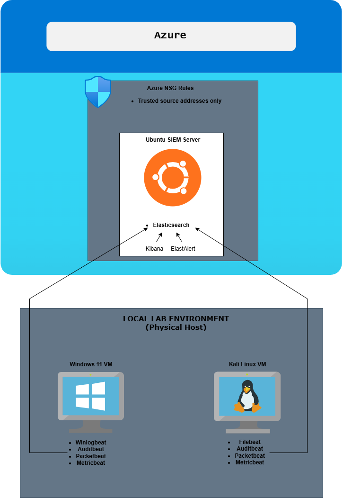
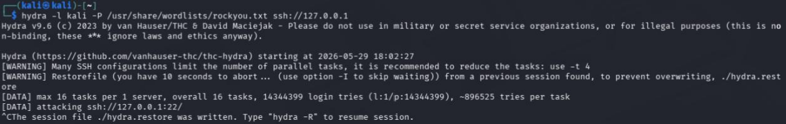
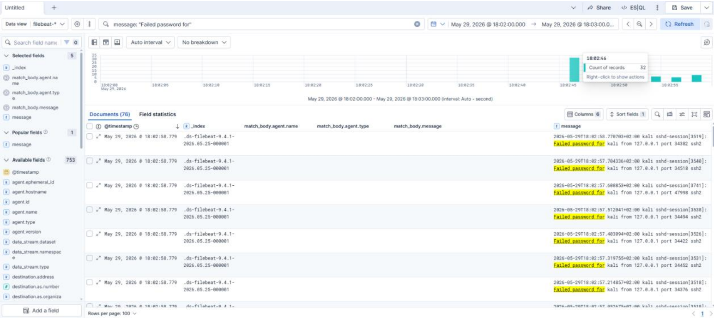
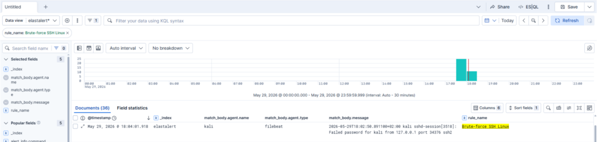

# Document-SIEM-Homelab-Elastic
Security monitoring and threat detection lab using Elasticsearch, Kibana, ElastAlert and Beats.

## Project Goals

The main goal of this project was to build a functional security monitoring environment that simulates a small SOC-like infrastructure.

The project includes:

- Centralized log collection from Linux and Windows hosts
- Deployment of Elasticsearch and Kibana as the SIEM backend
- Integration of multiple Beats agents
- Custom ElastAlert detection rules
- Kibana dashboards for authentication, network and system monitoring

## Infrastructure Overview

The environment consists of three main parts:

- **SIEM Server** — Ubuntu server hosting Elasticsearch, Kibana and ElastAlert
- **Linux Host** — Kali Linux machine generating Linux logs and network telemetry
- **Windows Host** — Windows 11 machine generating Windows event logs

The central SIEM server was deployed on an Ubuntu virtual machine hosted in Microsoft Azure. To reduce the attack surface and limit unauthorized access, administrative services were protected using Azure NSG rules. Access to management interfaces was restricted to trusted source address.

Logs and telemetry are collected from endpoint machines and sent to the central Elasticsearch instance. Kibana is used for visualization, while ElastAlert is responsible for rule-based detection and alert generation.

## Technology Stack

| Component | Purpose |
|-----------|---------|
| Elasticsearch | Centralized log storage and search engine |
| Kibana | Log analysis and visualization |
| ElastAlert | Detection rules and alerting |
| Filebeat | Linux log collection |
| Winlogbeat | Windows Event Log collection |
| Packetbeat | Network traffic monitoring |
| Auditbeat | File and system activity monitoring |
| Metricbeat | System performance monitoring |

# Attack Simulation & Detection

The following scenarios were implemented to validate the effectiveness of the deployed SIEM environment.

# SSH Brute Force Detection (Linux)

A brute-force attack against the Linux SSH service was simulated using Hydra. 

## Step 1 – Attack Simulation

---

## Step 2 – Event Collection

The authentication attempts generated during the attack were collected from Linux authentication logs by Filebeat and forwarded to Elasticsearch.

---

## Step 3 – Detection

The custom ElastAlert rule detected multiple failed authentication attempts.

Rule:

➡️ `detection-rules/linux/ssh_bruteforce.yaml`

> **Note:** The detection threshold used in this laboratory environment was intentionally lowered to enable quick validation during testing. In a production environment, thresholds and time windows should be adjusted to reflect normal user behavior and reduce the likelihood of false positives.

---
