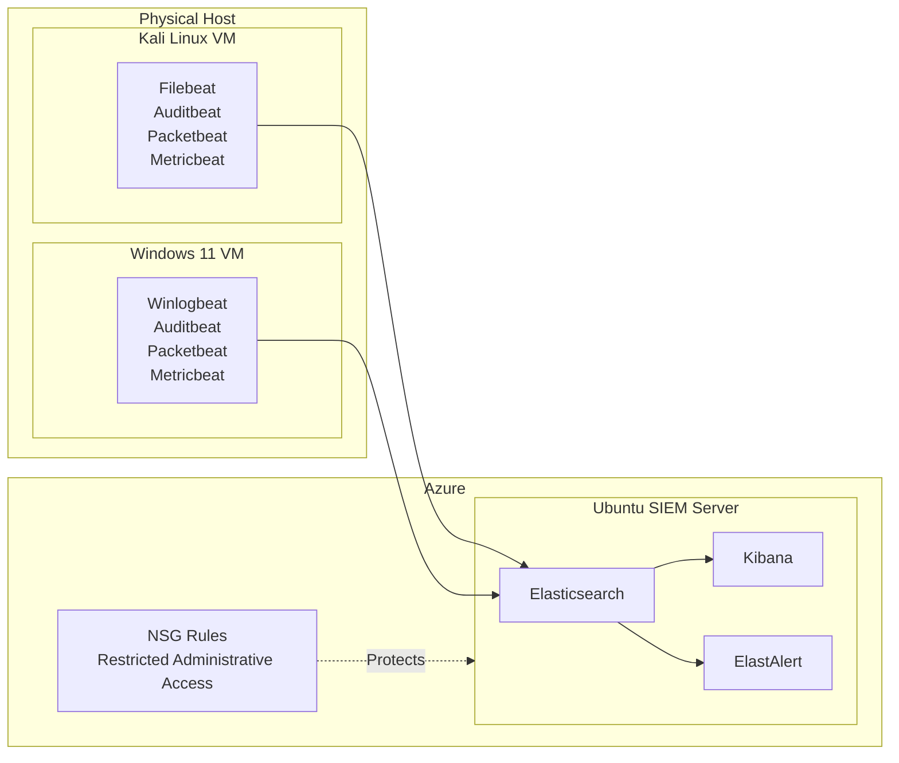

# Document-SIEM-Homelab-Elastic
Security monitoring and threat detection lab using Elasticsearch, Kibana, ElastAlert and Beats.

## Project Goals

The main goal of this project was to build a functional security monitoring environment that simulates a small SOC-like infrastructure.

The project includes:

- Centralized log collection from Linux and Windows hosts
- Deployment of Elasticsearch and Kibana as the SIEM backend
- Integration of multiple Beats agents
- Custom ElastAlert detection rules
- Kibana dashboards for authentication, network and system monitoring

## Infrastructure Overview

The environment consists of three main parts:

- **SIEM Server** — Ubuntu server hosting Elasticsearch, Kibana and ElastAlert
- **Linux Host** — Kali Linux machine generating Linux logs and network telemetry
- **Windows Host** — Windows 11 machine generating Windows event logs

The central SIEM server was deployed on an Ubuntu virtual machine hosted in Microsoft Azure. To reduce the attack surface and limit unauthorized access, administrative services were protected using Azure NSG rules. Access to management interfaces was restricted to trusted source address.

Logs and telemetry are collected from endpoint machines and sent to the central Elasticsearch instance. Kibana is used for visualization, while ElastAlert is responsible for rule-based detection and alert generation.

